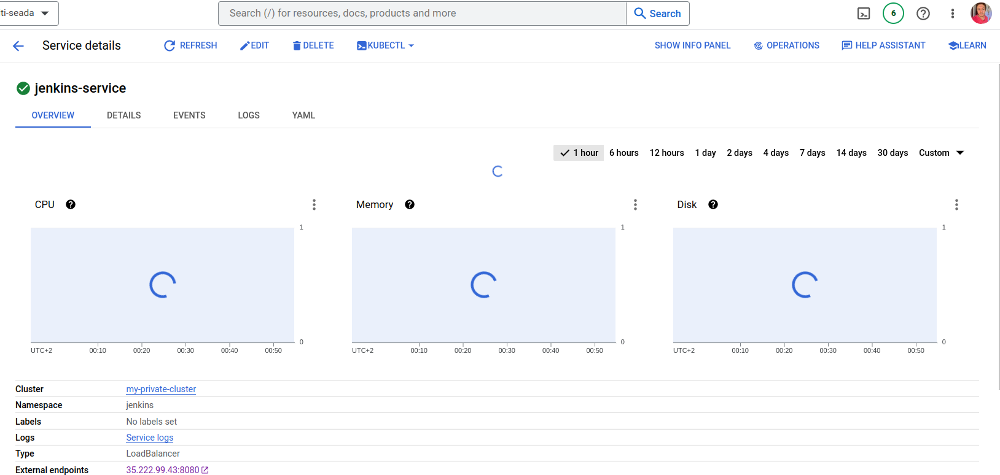
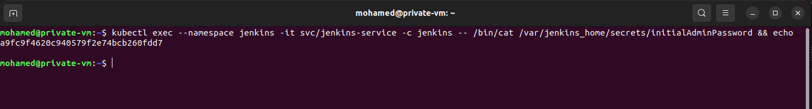

# GCP with Terraform and Jenkins 
## Project Overview:


Deploy a Python web application on GKE using CI/CD Jenkins Pipeline using the following steps and high-level diagram:
1. Implement a secure GKE Cluster
2. Deploy and configure Jenkins on GKE
3. Deploy the backend application on GKE using the Jenkins pipeline

## Tools:

| Tool | Purpose |
| ------ | ------ |
| [ Google Kubernetes Engine (GKE) ](https://cloud.google.com/kubernetes-engine) | Google Kubernetes Engine (GKE) is a managed, production-ready environment for running containerized applications. |
| [ Jenkins ](https://www.jenkins.io) | Jenkins – an open-source automation server is enabling developers worldwide to reliably build, test, and deploy their software. |
| [ Ansible ](https://www.ansible.com/) | Ansible is an open source community project sponsored by Red Hat, it's the simplest way to automate IT. Ansible is the only automation language that can be used across entire IT teams from systems and network administrators to developers and managers. |
| [ Docker ](https://www.docker.com) | Docker is a set of platform-as-a-service (PaaS) products that use OS-level virtualization to deliver software in containers|
| [ Terraform ](https://www.terraform.io) | Terraform is an open-source infrastructure as a code software tool that enables you to safely and predictably create, change, and improve infrastructure. |
| [ Kubernetes ](https://kubernetes.io/) | Kubernetes, also known as K8s, is an open-source system for automating deployment, scaling, and management of containerized applications. |

## Build the Infrastructure

### 1. Clone The Repo:
```
git clone https://github.com/seada98/ITI-Final-Project-Infrastructure
```
### 2. Navigate to the Terraform Code
> After you clone the code you need to navigate to the `terraform` folder to build the infrastructure:
```
cd Terraform/
```
#### 3. Initialize Terraform
```
terraform init
```

#### 4. Check Plan
```
terraform plan
```

#### 5. Apply the plan *it will take some time to complete*
```
terraform apply
```

## Script When The Build Finish Will Startup Automatically Start VM 


### The Script Will Do:

  * Install gcloud 
  * Install kubectl
  * Install gcloud plugin
  * Git Clone the repo
  * Install Ansible
  * Apply Ansible yaml File

### Ansible yaml Will Do:

  * Connect to cluster
  * Create Jenkins namespace
  * Deploying jenkins & loadbalancer servies

## Check Services To Get Url For Jenkins 



### To Get Jenkins Password Connect To VM And Type
```
kubectl exec --namespace jenkins -it svc/jenkins-service -c jenkins -- /bin/cat /var/jenkins_home/secrets/initialAdminPassword && echo
```



### Install Plugin And Create Your Admin User In Jenkins


## Now you are ready to use Jenkins on a GKE cluster!🚀

### Connected Repository:

CI/CD using Jenkins --> https://github.com/seada98/ITI-Final-Project-App